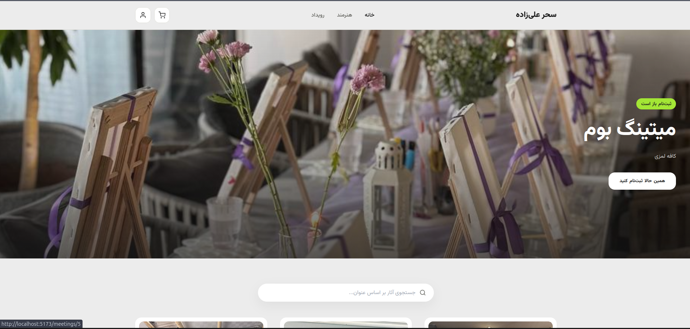
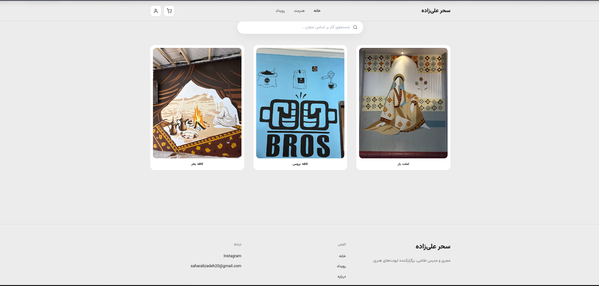

# Artist Portfolio & Booking Platform

Web application for a visual artist to showcase her work and let visitors browse and register (with payment) for her courses and meetings. Built as a real-world portfolio project — covering authentication, e-commerce flow, async task processing, and internationalization.





## ✨ Features

### Authentication & Accounts
- JWT-based authentication (signup, login, silent token refresh)
- Signup with username, password, optional email (unique), phone number, and optional age
- Automatic redirect back to the originally requested page after login (e.g. adding an item to cart while logged out)
- Per-user ownership checks — users can only view/cancel their own registrations

### Artist Portfolio
- Artist profile (bio, contact info, social links)
- Artwork gallery with search
- Full pagination and search/filtering (by price, date, location, and text) across artworks, courses, and meetings

### Courses & Meetings
- Course and meeting listings with seat capacity tracking (`seats_left` computed from paid registrations)
- Cart → checkout flow (mock payment, no real gateway) that atomically creates orders and marks registrations as paid
- Order history for logged-in users

### Async Processing (Celery + Redis)
- Asynchronous confirmation emails sent on successful checkout, so the request isn't blocked on SMTP
- Scheduled reminder emails via Celery Beat (hourly job) for events happening within 24 hours, with duplicate-send protection

### Internationalization (i18n/l10n)
- Full Persian (Farsi) UI with proper RTL layout

## 🛠️ Tech Stack

**Backend**
- Django & Django REST Framework
- PostgreSQL
- `djangorestframework-simplejwt` (JWT auth)
- `django-filter` (filtering/search)
- Celery + Redis (async tasks & scheduled jobs)
- Docker & Docker Compose

**Frontend**
- React (Vite)
- React Router
- Axios
- Tailwind CSS + `tailwindcss-rtl`
- `react-i18next`

## 📐 Architecture

```
services:
  backend        → Django REST API
  db             → PostgreSQL
  redis          → Celery broker & result backend
  celery-worker  → processes async tasks (emails)
  celery-beat    → schedules periodic tasks (reminders)
```

All services are containerized via Docker Compose for a consistent local development environment.

## 🚀 Getting Started

### Prerequisites
- Docker & Docker Compose
- Node.js (for frontend development outside Docker, if needed)

### Setup

1. Clone the repository:
   ```bash
   git clone <https://github.com/Mohhamadaminn/art_gallery_project>
   cd art_gallery_project
   ```

2. Create a `.env` file in the project root with the required environment variables (database credentials, Django secret key, etc.).

3. Build and start the backend services:
   ```bash
   docker compose up build
   ```

4. Run migrations:
   ```bash
   docker compose exec backend python manage.py migrate
   ```

5. Install and start the frontend:
   ```bash
   cd frontend
   npm install
   npm run dev
   ```

## 🗂️ Project Structure

```
backend/
  apps/portfolio/     # Models, serializers, views, tasks, filters
  config/              # Django project settings, Celery app config
frontend/
  src/
    api/               # Axios instances + shared auth interceptor
    context/           # Auth & Cart context providers
    pages/              # Route-level page components
    components/         # Reusable UI components
    locales/             # en.json / fa.json translation files
```